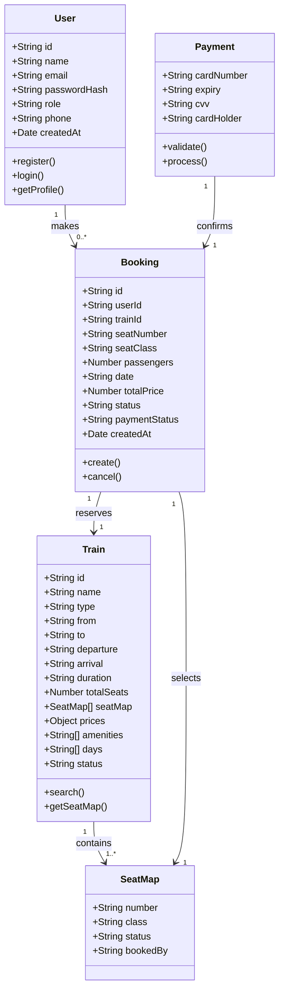

EVOTR#  Smart Train Travel Reservation System

## Change History

| Version | Date | Author | Description |
|---------|------|--------|-------------|
| 1.0 | April 2026 | Team | Initial release |

---

## Table of Contents

- [1. Scope](#1-scope)
- [2. References](#2-references)
- [3. Software Architecture](#3-software-architecture)
- [4. Architectural Goals & Constraints](#4-architectural-goals--constraints)
- [5. Logical Architecture](#5-logical-architecture)
- [6. Process Architecture](#6-process-architecture)
- [7. Development Architecture](#7-development-architecture)
- [8. Physical Architecture](#8-physical-architecture)
- [9. Scenarios](#9-scenarios)
- [10. Size and Performance](#10-size-and-performance)
- [11. Quality](#11-quality)
- [Appendices](#appendices)

---

## List of Figures

- Figure 1 — High-Level Architecture Diagram (3-layer)
- Figure 2 — Component Diagram (Express routes and data layer)
- Figure 3 — Process Architecture: User Login and Train Search
- Figure 4 — Process Architecture: Seat Selection and Booking
- Figure 5 — Process Architecture: Admin Views Dashboard
- Figure 6 — Physical Architecture: Deployment Diagram
- Figure 7 — Scenarios: Use Case Diagram
- Figure 8 — Scenarios: User Searches and Books a Train
- Figure 9 — Scenarios: Round-Trip Search
- Figure 10 — Scenarios: Admin Manages System
- Figure 11 — Development Package Diagram

---

## 1. Scope

This document describes the software architecture of the **SmartTrain — Smart Train Travel Reservation System**, a web-based platform developed as part of the **SWE332 Software Architecture** course at Altınbaş University (2025–2026).

The architecture is documented using the **4+1 Architectural View Model**, covering the logical, process, development, physical, and scenario views of the system.

### What This Document Covers

- The web application architecture (Node.js + Express.js backend, HTML/CSS/JS SPA frontend)
- User authentication and role-based access control (Guest, Registered User, Admin)
- Train search system (one-way and round-trip, multi-city)
- Interactive seat selection and booking management
- Simulated payment processing with card validation
- Admin panel for managing trains, bookings, and users
- In-memory data store structure and data flow
- Deployment configuration for local demonstration

### What This Document Does Not Cover

- Real payment gateway integration (not part of the system)
- Mobile application development
- Online/cloud deployment (system is demonstrated locally)
- Real-time train tracking or live schedule feeds
- Email notification integration (optional future feature)
- External train operator APIs

---

## 2. References

| ID | Source |
|----|--------|
| [1] | Kruchten, P. (1995). The 4+1 View Model of Architecture. IEEE Software, 12(6), 42–50. |
| [2] | Node.js Documentation. https://nodejs.org/en/docs |
| [3] | Express.js Documentation. https://expressjs.com |
| [4] | JSON Web Tokens (JWT). https://jwt.io |
| [5] | bcryptjs npm package. https://www.npmjs.com/package/bcryptjs |
| [6] | Mermaid Diagramming Tool. https://mermaid.js.org |
| [7] | GitHub. https://github.com |
| [8] | MDN Web Docs (HTML, CSS, JS). https://developer.mozilla.org |

---

## 3. Software Architecture

The SmartTrain system follows a **Layered (N-Tier) Architecture**, combined with a **Single Page Application (SPA)** pattern on the frontend. The system is divided into three primary layers that separate concerns and promote maintainability.

### Architectural Style: Layered Architecture

In a layered architecture, each layer has a specific responsibility and only communicates with the layer directly adjacent to it. This makes the system easier to develop, test, and maintain — especially for a team working in parallel on different components.

### System Layers

| Layer | Technology | Responsibility |
|-------|-----------|----------------|
| Presentation Layer | HTML5, CSS3, Vanilla JavaScript (SPA) | Renders the user interface for passengers and admins |
| Application Layer | Node.js + Express.js | Handles business logic, routing, authentication, and data processing |
| Data Layer | In-Memory JavaScript Objects | Stores and manages all system data — users, trains, bookings |

### Component Overview

The system is composed of the following main components:

**Single Page Application (SPA):** One HTML file with dynamic sections rendered by JavaScript. Includes Home, Search, My Bookings, Admin Panel, and modals — all without page reloads.

**Authentication Module:** Manages user registration, login, and role-based access control for two roles — Registered User and Admin. JWT tokens are issued on login and verified on every protected request.

**Train Search Module:** Allows users to search for trains between any two Turkish cities by date, class, and number of passengers. Supports both one-way and round-trip searches.

**Seat Selection & Booking Module:** Displays an interactive visual seat map. Users select a seat, proceed through a payment form, and receive confirmation. Prevents double-booking through server-side seat availability checks.

**Admin Panel Module:** Displays system statistics (total trains, users, bookings, revenue). Admins can view and manage all bookings, trains, and users.

### Figure 1 — High-Level Architecture Diagram

```
┌────────────────────────────────────────────────────┐
│               Presentation Layer                   │
│   HTML5 + CSS3 + Vanilla JavaScript (SPA)          │
│   index.html · style.css · animations.css · app.js │
└─────────────────────┬──────────────────────────────┘
                      │  HTTP / REST (JSON)
┌─────────────────────▼──────────────────────────────┐
│               Application Layer                    │
│   Node.js + Express.js                             │
│   server.js · routes/ · middleware/auth.js         │
└─────────────────────┬──────────────────────────────┘
                      │  JavaScript function calls
┌─────────────────────▼──────────────────────────────┐
│                 Data Layer                         │
│   In-Memory JavaScript (db.js)                    │
│   users[] · trains[] · bookings[]                 │
└────────────────────────────────────────────────────┘
```

---

## 4. Architectural Goals & Constraints

### 4.1 Architectural Goals

The following quality goals shaped the key architectural decisions made in this system:

| Priority | Goal | Description |
|----------|------|-------------|
| High | Security | User data and booking information must be protected. The system enforces JWT-based authentication and role-based access control (User, Admin). Passwords are hashed with bcryptjs; no sensitive data is stored in plain text. |
| High | Usability | The platform targets everyday travelers. The interface must be simple, intuitive, and accessible from any standard web browser without installation. |
| High | Reliability | Seat booking must be accurate and consistent. The system must prevent double-booking and ensure confirmed bookings are always stored correctly. |
| Medium | Maintainability | Routes, middleware, and data are structured in clearly separated modules so that individual components can be updated or extended without affecting others. |
| Medium | Performance | The system must respond to user actions promptly. Search results and booking confirmations should complete without perceptible delay. |
| Low | Scalability | While the current scope is a university project, the layered architecture allows the data layer to be replaced with a real database (e.g., MySQL) in future without touching the business logic. |

### 4.2 Architectural Constraints

#### Technical Constraints

- **Node.js + Express.js Backend:** The backend must be implemented using Node.js and Express.js. This was decided at project inception and is non-negotiable.
- **In-Memory Database:** The system uses JavaScript arrays in `db.js` as its data store. All data relationships (users, trains, bookings) must be managed in-process. Data does not persist across server restarts.
- **Browser-Based SPA Frontend:** The frontend must run in a standard web browser using HTML, CSS, and JavaScript — no frameworks, no build step, no page reloads.
- **JWT Authentication:** All protected endpoints require a valid JWT token in the `Authorization` header.

#### Business Constraints

- **Academic Deadline:** The project must be completed within the semester timeline. This limits scope and influenced the choice of simple, well-documented technologies.
- **Team Size:** The system is built by a four-person student team. Architecture must support parallel development with minimal dependencies between members.
- **No Budget:** The project relies entirely on free and open-source tools. No paid APIs, cloud services, or licensed software may be used.

#### Regulatory Constraints

- **Data Privacy:** User booking data is sensitive. Role-based access ensures users can only view and cancel their own bookings. Admin-only endpoints are protected by role verification inside the JWT payload.

---

## 5. Logical Architecture

### Overview

The Logical Architecture describes the key entities of the SmartTrain system, their attributes, responsibilities, and relationships. It supports the functional requirements by decomposing the system into meaningful objects derived from the problem domain.

The core entities are: **User**, **Train**, **Booking**, **SeatMap**, and **Payment**. These entities interact to support train searching, seat selection, booking management, and admin oversight.

### Key Design Decisions

**1. User as a single entity with a role field**
Rather than separate classes for Passenger and Admin, a single `User` object holds a `role` field (`"user"` or `"admin"`). This avoids duplicate authentication logic and simplifies JWT payload design.

**2. Booking as the central transaction object**
`Booking` connects a `User` to a `Train` at a specific seat, date, and class. It is the core record of every completed reservation.

**3. SeatMap embedded inside Train**
Each `Train` object contains a `seatMap` array representing the physical layout of seats and their status (`available` / `booked`). This ensures seat state is always consistent with the train it belongs to.

**4. Payment not stored as a separate entity**
Payment details (card number, expiry, CVV) are validated client-side only and never persisted. A `paymentStatus` field on `Booking` records the outcome without storing sensitive card data.

### Class Diagram (Mermaid)



---

## 6. Process Architecture

The Process Architecture describes the dynamic behavior of the SmartTrain system at runtime. It illustrates how the system's components interact during key operations, focusing on request flows, data exchange, and decision points. This view is represented using UML Sequence Diagrams.

### 6.1 User Login and Train Search

This diagram illustrates user authentication followed by a train search — the most common combined flow in the system.

```
User          Browser (SPA)       Express Server       db.js
 │                │                    │                 │
 │──POST /login──▶│                    │                 │
 │                │──POST /api/auth/login──▶             │
 │                │                    │──findUser()────▶│
 │                │                    │◀──user object───│
 │                │                    │  bcrypt.compare()
 │                │                    │  jwt.sign()     │
 │                │◀──{ token, user }──│                 │
 │                │ store token in     │                 │
 │                │ localStorage       │                 │
 │──Search form──▶│                    │                 │
 │                │──POST /api/trains/search──▶          │
 │                │  { from, to, date, class, pax }      │
 │                │                    │──filterTrains()▶│
 │                │                    │◀──train[]───────│
 │                │◀──{ data: train[] }│                 │
 │◀──Train cards──│                    │                 │
```

### 6.2 Seat Selection and Booking

This diagram shows the complete booking flow from seat selection through payment confirmation.

```
User           Browser (SPA)      Express Server        db.js
 │                 │                   │                  │
 │──Select seat───▶│                   │                  │
 │                 │──GET /api/trains/:id──▶              │
 │                 │                   │──findTrain()────▶│
 │                 │◀──{ seatMap }─────│                  │
 │◀──Seat map UI───│                   │                  │
 │──Click seat────▶│ highlight seat     │                  │
 │──Enter payment─▶│ validate card     │                  │
 │──Confirm────────│                   │                  │
 │                 │──POST /api/bookings (+ JWT header)──▶│
 │                 │                   │ auth.js: verify JWT
 │                 │                   │──checkSeatAvail()▶│
 │                 │                   │  if taken → 409  │
 │                 │                   │──markSeat()─────▶│
 │                 │                   │──createBooking()─▶│
 │                 │◀──{ booking }─────│                  │
 │◀──Confirmation──│                   │                  │
```

### 6.3 Admin Views Dashboard

This diagram illustrates how an admin accesses the system dashboard after authentication.

```
Admin          Browser (SPA)      Express Server      db.js
 │                 │                   │                │
 │──Login (admin)─▶│──POST /api/auth/login──▶           │
 │                 │◀──{ token, role:"admin" }──────────│
 │──Click Admin────│                   │                │
 │                 │──GET /api/admin/stats (+JWT)──▶    │
 │                 │                   │ auth.js: verify JWT
 │                 │                   │ check role === "admin"
 │                 │                   │──countAll()───▶│
 │                 │◀──{ users, trains, bookings, revenue }
 │◀──Dashboard UI──│                   │                │
```

---

## 7. Development Architecture

The Development Architecture describes how the source code of the SmartTrain system is organized into modules, layers, and files. It shows the folder structure, how files depend on each other, and which technologies are used .

### 7.1 Project Modules

| Module                               | Type                             | Responsibility                                                
| `frontend/public/index.html`         | SPA shell      | Serves as the main and only HTML file of the application. All 
                                                        | views such as Home, Search, Bookings, and Admin Panel are  defined
                                                        | here and dynamically displayed without reloading the page.                                      
| `frontend/public/css/style.css`      | Stylesheet     | Contains the primary visual design of the application, including 
                                                        | layout structure, colors, typography, and overall theme.                                                                                                    
| `frontend/public/css/animations.css` | Stylesheet     | Provides animation effects such as transitions, hover 
                                                        |interactions, and visual feedback to improve user experience |                                                                                                              
| `frontend/public/js/app.js`          | Frontend logic | Implements all client-side functionality, including navigation 
                                                        | between views, API communication using `fetch()`, 
                                                        | rendering dynamic content (train results, seat maps, bookings), 
                                                        | and managing authentication state in the browser. 

### 7.2 Main Package Diagram

```
smarttrain/
│
├── backend/                         ← Application Layer
│   ├── server.js                    ← Express entry point & static file server
│   ├── package.json                 ← npm dependencies
│   ├── middleware/
│   │   └── auth.js                  ← JWT verification middleware
│   ├── routes/
│   │   ├── auth.js                  ← /api/auth/*
│   │   ├── trains.js                ← /api/trains/*
│   │   ├── bookings.js              ← /api/bookings/*
│   │   └── admin.js                 ← /api/admin/*
│   └── data/
│       └── db.js                    ← In-memory data store (Data Layer)
│
└── frontend/public/                 ← Presentation Layer
    ├── index.html                   ← SPA shell (single file)
    ├── css/
    │   ├── style.css                ← Main stylesheet
    │   └── animations.css           ← Animation overrides
    └── js/
        └── app.js                   ← All frontend JavaScript
```

### 7.3 SPA Pattern — Frontend Architecture

The frontend follows a **Single Page Application** pattern. There is one `index.html` file. All views (Home, Search, My Bookings, Admin Panel) are rendered as `<section>` elements that are shown or hidden by JavaScript. No page reloads occur.

| SPA Component | File | Responsibility |
|---------------|------|----------------|
| View sections | `index.html` | HTML markup for Home, Search, Bookings, Admin |
| Navigation | `app.js → navigate()` | Shows/hides sections, updates active nav item |
| API calls | `app.js → fetch()` | All REST calls to the Express backend |
| Rendering | `app.js → render*()` | Builds train cards, seat maps, booking rows dynamically |
| Auth state | `app.js → localStorage` | Stores JWT and user info between sessions |

### 7.4 Module Descriptions

**`server.js`**
The Express application entry point. Registers all route modules under `/api/*`, serves the frontend's `public/` folder as static files on port 3000, and applies JSON body parsing middleware.

**`routes/auth.js`**
Handles user registration (with bcryptjs password hashing), login (returns a signed JWT), and a protected `/me` endpoint that returns the current user's profile.

**`routes/trains.js`**
Provides endpoints to list all trains, list all available cities, search trains by `from`, `to`, `date`, `class`, and `passengers`, and retrieve a single train with its full seat map.

**`routes/bookings.js`**
Handles booking creation (checks seat availability, marks seat as booked, creates a booking record), retrieval of the logged-in user's bookings, single booking detail, and booking cancellation (releases the seat).

**`routes/admin.js`**
Admin-only endpoints. Returns system statistics (total trains, users, bookings, revenue), all users, all bookings with user details, and all trains with occupancy percentages. Every route checks `req.user.role === "admin"`.

**`middleware/auth.js`**
Extracts the `Bearer` token from the `Authorization` header, verifies it with `jwt.verify()`, and attaches the decoded payload as `req.user`. Returns 401 if missing or invalid.

**`data/db.js`**
The in-memory data store. Contains:
- `users[]` — registered user objects
- `trains[]` — all train records with seat maps
- `bookings[]` — confirmed booking records
- `generateSeatMap(n)` — helper that creates a seat array with economy/business/first class zones

**`app.js`** (frontend)
The entire frontend application in one file (~800 lines). Key functions include:
- `navigate(view)` — SPA routing
- `doSearch()` / `doRoundTripSearch()` — train search API calls
- `renderTrainResults()` / `renderTrainCardsHTML()` — train card rendering
- `openBookingFlow()` — opens seat map modal
- `renderSeatMap()` — builds the interactive seat grid
- `confirmBooking()` — submits booking via API
- `loadMyBookings()` — fetches and renders user's booking history
- `loadAdminDashboard()` — loads admin stats and data tables

### 7.5 Module Dependencies

| Module | Depends On | Reason |
|--------|-----------|--------|
| `routes/auth.js` | `data/db.js`, `bcryptjs`, `jsonwebtoken` | Needs user store, password hashing, token signing |
| `routes/trains.js` | `data/db.js` | Reads train and city data |
| `routes/bookings.js` | `data/db.js`, `middleware/auth.js` | Reads/writes bookings, requires auth |
| `routes/admin.js` | `data/db.js`, `middleware/auth.js` | Reads all data, requires admin role |
| `middleware/auth.js` | `jsonwebtoken` | Verifies JWT tokens |
| `app.js` (frontend) | Express REST API | All data fetched via `/api/*` endpoints |

**Key Dependency Rules:**

- **Rule 1 — Layered dependency:** Frontend never touches `db.js` directly. All data flows through the Express API.
- **Rule 2 — No circular dependencies:** Routes do not import from each other. Shared data is accessed through `db.js`.
- **Rule 3 — Auth isolation:** JWT verification logic is entirely in `middleware/auth.js`. Routes apply it as needed with `router.use(auth)` or per-endpoint.

### 7.6 Technology Stack

| Layer | Technology | Version | Purpose | Why Chosen |
|-------|-----------|---------|---------|-----------|
| Frontend | HTML5 | 5 | Page structure | Standard markup, works in all browsers |
| Frontend | CSS3 | 3 | Visual styling | Dark-blue theme, animations, responsive |
| Frontend | JavaScript | ES6+ | SPA logic, API calls | No build step needed, lightweight |
| Backend | Node.js | 18+ | Server runtime | Fast, JavaScript everywhere |
| Backend | Express.js | 4.x | Web framework (REST API) | Minimal, flexible, widely used |
| Auth | jsonwebtoken | latest | JWT signing/verification | Stateless, standard, scalable |
| Auth | bcryptjs | latest | Password hashing | Secure and dependency-free |
| Data | In-Memory (JS) | — | Data persistence | Simplicity for academic context |
| Version Control | Git + GitHub | latest | Source control | Required; supports team workflow |
| Documentation | Markdown | — | Architecture docs | Renders natively on GitHub |
| Diagrams | Mermaid | — | Diagrams in Markdown | Renders in GitHub without external tools |

---

## 8. Physical Architecture

The Physical Architecture describes the mapping of software components onto hardware nodes and the communication paths between them. It answers: **where does each part of the system actually run?**

### 8.1 System Nodes

| Node | Description |
|------|-------------|
| Client Device | The end user's machine (laptop, desktop, or mobile). Runs a standard web browser. No installation required. |
| Web & API Server | Runs Node.js + Express.js. Serves the SPA static files AND handles all `/api/*` REST endpoints from the same process on port 3000. |
| In-Memory Data Store | Lives inside the Node.js process as JavaScript arrays in `db.js`. No separate database server is needed. |

### 8.2 Communication Protocols

| Connection | Protocol | Description |
|-----------|---------|-------------|
| Client → Server (SPA files) | HTTP | Browser downloads `index.html`, `style.css`, `app.js` once on first visit |
| Client → Server (API calls) | HTTP + JSON | Browser's `fetch()` sends REST requests; server returns JSON responses |
| Server → In-Memory Store | Direct JS call | Express route handlers call functions in `db.js` synchronously |

### 8.3 Deployment Diagram

```
┌─────────────────────────────────────────────────────────┐
│                  Developer Machine                      │
│                                                         │
│   ┌──────────────────────────────────────────────────┐  │
│   │          Node.js Process (port 3000)             │  │
│   │                                                  │  │
│   │  ┌────────────────┐   ┌────────────────────┐    │  │
│   │  │  Express.js    │   │   In-Memory DB     │    │  │
│   │  │  - server.js   │◄─▶│   - data/db.js     │    │  │
│   │  │  - routes/     │   │   users[]          │    │  │
│   │  │  - middleware/ │   │   trains[]         │    │  │
│   │  └───────┬────────┘   │   bookings[]       │    │  │
│   │          │            └────────────────────┘    │  │
│   │  ┌───────▼────────┐                             │  │
│   │  │  Static Files  │                             │  │
│   │  │  frontend/     │                             │  │
│   │  │  public/       │                             │  │
│   │  └────────────────┘                             │  │
│   └──────────────────────────────────────────────────┘  │
│                        ▲                                │
│               HTTP on localhost:3000                    │
│                        │                                │
│   ┌────────────────────▼─────────────────────────────┐  │
│   │               Web Browser (Client)               │  │
│   │         index.html · app.js · style.css          │  │
│   └──────────────────────────────────────────────────┘  │
└─────────────────────────────────────────────────────────┘
```

### 8.4 Physical Architecture Decisions

**Why is the SPA served by the same Express server?**
Serving the frontend from the same Node.js process eliminates the need for a separate web server (e.g., Nginx). It simplifies local development to a single `node server.js` command and avoids CORS issues entirely since the API and frontend share the same origin.

**Why an in-memory database?**
For a university project, an in-memory store provides zero setup — no database installation, configuration, or migration scripts. The data layer is isolated in `db.js` so that replacing it with MySQL or MongoDB in the future only requires changing one file.

**Why Node.js?**
Using JavaScript on both frontend and backend means the entire team works in one language. Express.js is minimal and well-documented, reducing the learning curve during the limited project timeline.

---

## 9. Scenarios

The Scenarios view represents the **+1** in the 4+1 Architectural View Model. It describes the most significant use cases of the system and demonstrates how the architecture supports them.

### 9.1 Use Case Diagram

```
                        SmartTrain System
                   ┌─────────────────────────┐
                   │                         │
 [Guest]──────────▶│  Browse Home Page        │
                   │  Search Trains (one-way) │◀──────[Registered User]
                   │                         │
 [Registered User]▶│  Search Trains (round)  │
                   │  Select Seat            │
                   │  Confirm Booking        │
                   │  View My Bookings       │
                   │  Cancel Booking         │
                   │                         │
 [Admin]──────────▶│  View Dashboard Stats   │
                   │  Manage All Bookings    │
                   │  Manage Users           │
                   │  Manage Trains          │
                   └─────────────────────────┘
```

### 9.2 Scenario 1: User Searches and Books a Train

**Actor:** Registered User
**Goal:** Find an available train and book a seat
**Precondition:** User is registered and logged in

1. User selects "One Way", picks From: Istanbul, To: Ankara, a date, 1 passenger, Economy class
2. Clicks "Search Trains" → `POST /api/trains/search` returns matching trains
3. User clicks "Select Seat →" on preferred train
4. Seat map modal opens → user clicks an available Economy seat
5. Booking modal opens → user enters card details, clicks Confirm
6. `POST /api/bookings` → seat marked as booked → booking record created
7. Confirmation shown with booking ID and total price

### 9.3 Scenario 2: Round-Trip Search

**Actor:** Registered User
**Goal:** Book both outbound and return legs of a journey
**Precondition:** User is registered and logged in

1. User selects "Round Trip" tab → Return Date field appears
2. User fills: From: Izmir, To: Ankara, Departure: Apr 15, Return: Apr 18
3. Clicks "Search Trains" → two parallel `POST /api/trains/search` calls
4. Results show in two sections: 🚄 Outbound and 🔄 Return
5. User books outbound seat → then returns to results and books return seat
6. Both bookings visible under "My Bookings"

### 9.4 Scenario 3: Admin Manages System

**Actor:** Admin
**Goal:** Monitor system activity and manage bookings
**Precondition:** Admin is logged in with `role: "admin"`

1. Admin logs in → JWT payload contains `role: "admin"`
2. Admin Panel tab appears in navigation
3. Admin clicks Admin Panel → `GET /api/admin/stats` returns totals
4. Dashboard shows: total trains, total users, bookings, revenue
5. Admin views all bookings table → can see passenger, train, seat, status
6. Admin views all users table with registration dates

### 9.5 Scenario 4: Guest Browses Without Logging In

**Actor:** Guest (unauthenticated)
**Goal:** Explore the site before registering
**Precondition:** None — Home page is publicly accessible

1. Guest visits `http://localhost:3000` → lands on Home page
2. Guest sees hero section, search widget, features info
3. Guest clicks "Round Trip" or "One Way" tabs → tours the UI
4. Guest clicks "Search Trains" without logging in → search is allowed
5. Guest tries to book a train → system prompts "Please log in to book"
6. Guest registers → can complete booking

---

## 10. Size and Performance

This section documents the expected size of the SmartTrain system and defines measurable performance targets. The system is classified as a **small web application** intended for academic demonstration.

### 10.1 System Size Estimates

The system consists of 4 Express route files, approximately 800 lines of frontend JavaScript, 1,500 lines of CSS, and a data store with ~170+ train records covering all Turkish city pairs. It serves around 100 registered users, 170+ trains, and an unlimited number of bookings in its first demonstration year.

### 10.2 Response Time Targets

| Action | Target | Why |
|--------|--------|-----|
| Home page load | < 1.0 second | Static files served directly by Express |
| Login / Register | < 0.5 seconds | Single array lookup + bcrypt compare |
| Train search | < 1.0 second | In-memory array filter, no disk I/O |
| Seat map load | < 0.5 seconds | Single train object retrieval |
| Booking confirmation | < 1.0 second | Array write + seat status update |
| Admin dashboard | < 1.5 seconds | Multiple array aggregations |

Since the data layer is entirely in-memory, all operations are significantly faster than database-backed systems. Response times are dominated by network latency on localhost.

### 10.3 Concurrent Users

The system targets **20–30 concurrent users** for a university demonstration. Node.js's event-loop architecture handles concurrent requests efficiently without spawning new threads. This is well within the capacity of a single-process Express application.

### 10.4 Data Size Estimates

| Collection | Initial | Year 1 | Notes |
|-----------|---------|--------|-------|
| `trains[]` | 170 records | 170 records | Static; set at startup |
| `users[]` | 2 (demo accounts) | ~100 | Grows with registration |
| `bookings[]` | 1 (demo booking) | ~500 | Grows with usage |

All data lives in RAM; the entire data store is estimated at **< 5 MB** even at Year 1 scale — negligible for modern hardware.

### 10.5 Performance Constraints

| Constraint | Impact | Mitigation |
|-----------|--------|-----------|
| In-memory storage | Data lost on server restart | Acceptable for academic scope |
| Single Node.js process | No horizontal scaling | Sufficient for demonstration scale |
| No database indexing | Linear search through arrays | Arrays are small enough that this is imperceptible |
| No caching layer | Repeated computations on each request | Not needed at this scale |

---

## 11. Quality

This section defines the quality attributes of the SmartTrain system. It includes a quality goals table and measurable quality scenarios for each attribute.

### 11.1 Quality Goals

| Quality Attribute | Priority | Reason |
|------------------|---------|--------|
| Security | HIGH | User accounts and booking data must be protected. JWT and bcrypt are non-negotiable. |
| Usability | HIGH | Passengers of all ages must be able to search and book trains without guidance. |
| Reliability | HIGH | The system must prevent double-bookings and not lose confirmed reservations during a session. |
| Performance | HIGH | Search results and booking confirmations must feel instant (in-memory backend supports this). |
| Maintainability | MEDIUM | Team must be able to add cities, routes, or features without restructuring the codebase. |
| Portability | LOW | The system should run on any OS with Node.js installed (Windows, macOS, Linux). |

### 11.2 Quality Tree

```
SmartTrain Quality
├── Security
│   ├── Passwords hashed with bcryptjs (never stored in plain text)
│   ├── JWT tokens expire and are verified on every protected request
│   └── Admin routes check role === "admin" in token payload
├── Usability
│   ├── SPA — no page reloads, instant view transitions
│   ├── Search results appear within 1 second
│   └── Interactive seat map with visual available/booked states
├── Reliability
│   ├── Server-side seat availability check before every booking
│   ├── Toast notifications for all errors and confirmations
│   └── Round-trip validation ensures return date is after departure
├── Performance
│   ├── In-memory data store — zero disk I/O on searches
│   ├── Parallel fetch() for round-trip outbound + return searches
│   └── Static files served directly by Express with no processing
├── Maintainability
│   ├── New cities added by editing db.js trains[] array only
│   ├── Routes isolated in separate files (auth, trains, bookings, admin)
│   └── Frontend rendering separated from business logic via fetch/API
└── Portability
    ├── Zero OS-specific dependencies — pure Node.js
    └── Single command startup: node server.js
```

### 11.3 Quality Scenarios

#### 11.3.1 Security
**Scenario:** A user attempts to access another user's booking by guessing a booking ID.
- **Source:** Unauthorized user
- **Stimulus:** GET `/api/bookings/BK-000123` with their own JWT
- **Response:** `bookings.js` checks `booking.userId === req.user.id`; returns HTTP 403 if mismatch
- **Measure:** 0 unauthorized data exposures; all passwords hashed; JWT required on all write endpoints

#### 11.3.2 Usability
**Scenario:** A first-time user wants to book a round-trip ticket.
- **Source:** New user (no prior training)
- **Stimulus:** User clicks "Round Trip" tab
- **Response:** Return date field appears immediately; results show two labeled sections
- **Measure:** Booking completed in under 5 minutes; no external help required

#### 11.3.3 Reliability
**Scenario:** Two users attempt to book the same seat on the same train at the same time.
- **Source:** Two concurrent users
- **Stimulus:** Simultaneous `POST /api/bookings` for the same `trainId` + `seatNumber`
- **Response:** First request marks seat as booked; second finds `seat.status !== "available"` and returns HTTP 409
- **Measure:** 0 double-bookings; seat state always consistent with booking records

#### 11.3.4 Performance
**Scenario:** A user searches for trains between Eskisehir and Bursa.
- **Source:** Registered user
- **Stimulus:** `POST /api/trains/search` with `{ from: "Eskisehir", to: "Bursa" }`
- **Response:** In-memory `Array.filter()` returns results immediately
- **Measure:** Response time < 100ms on localhost; no perceptible delay in the UI

#### 11.3.5 Maintainability
**Scenario:** A developer needs to add a new city pair (e.g., Trabzon → Ankara).
- **Source:** Developer
- **Stimulus:** New route requirement
- **Response:** Add one train object to `trains[]` in `db.js`; no other files need changing
- **Measure:** New route live after server restart; zero changes to routes, middleware, or frontend

### 11.4 Quality Summary

| Attribute | Priority | Key Target | How Achieved |
|-----------|---------|-----------|--------------|
| Security | HIGH | 0 plain-text passwords, JWT on all writes | bcryptjs + jsonwebtoken + role checks |
| Usability | HIGH | Booking in < 5 min, no training needed | SPA, toast notifications, visual seat map |
| Reliability | HIGH | 0 double-bookings per session | Server-side seat availability check |
| Performance | HIGH | Search < 1s, booking < 1s | In-memory arrays, parallel fetch() |
| Maintainability | MEDIUM | New city in 1 file change | Isolated db.js data layer |
| Portability | LOW | Runs on Windows/macOS/Linux | Pure Node.js, no OS dependencies |

---

## Appendices

### A. Acronyms and Abbreviations

| Abbreviation | Full Form | Description |
|-------------|----------|-------------|
| API | Application Programming Interface | A bridge that allows software components to communicate |
| CSS | Cascading Style Sheets | The styling language used for the frontend user interface |
| JWT | JSON Web Token | A compact, signed token used for stateless authentication |
| HTTP | Hyper Text Transfer Protocol | The protocol used for communication between browser and server |
| JS | JavaScript | The scripting language used in both frontend and backend |
| REST | Representational State Transfer | The API architectural style used for all endpoints |
| SPA | Single Page Application | A web app that loads one HTML page and dynamically updates content |
| SQL | Structured Query Language | Not used directly; mentioned in context of future database migration |
| UI | User Interface | The visual layer that users interact with in the browser |
| UML | Unified Modeling Language | The standard notation used for architectural diagrams |
| URL | Uniform Resource Locator | A web address used to access system endpoints |
| 4+1 | 4+1 Architectural View Model | The documentation framework used to describe this system |

---

### B. Definitions

| Term | Definition |
|------|-----------|
| Booking | A confirmed reservation between a User and a Train seat at a specific date and class |
| Authentication | The process of verifying a user's identity via email and password |
| Authorization | The process of checking whether an authenticated user has permission to perform an action |
| Double-Booking | A conflict where two users reserve the same seat on the same train — prevented by the system |
| Express.js | A minimal Node.js web framework used to build the REST API backend |
| In-Memory Store | A data store that lives entirely in RAM as JavaScript arrays; data is lost on server restart |
| JWT (JSON Web Token) | A signed token issued after login, sent with every protected API request to prove identity |
| Node.js | A JavaScript runtime that allows JavaScript to be executed server-side |
| Round-Trip | A search that finds both an outbound train and a return train for a two-leg journey |
| Seat Map | A visual grid representing all seats on a train, showing available and booked states |
| SPA | A single-page web application where all views are rendered in one HTML file without page reloads |

---

### C. Design Principles

This appendix documents the core design principles that guided the architectural and development decisions made in SmartTrain.

#### 1. Separation of Concerns (SoC)

**Definition:** Each component of the system should be responsible for one distinct aspect of functionality.

**Application:** The system is divided into clearly distinct modules — authentication, train data, bookings, and admin. The frontend (SPA) only communicates with the backend via the REST API and never directly accesses `db.js`. A change in the data store structure only requires updating `db.js` and the affected route file.

#### 2. Single Responsibility Principle (SRP)

**Definition:** Every module should have one job and one reason to change.

**Application:** `middleware/auth.js` has a single responsibility — verifying JWT tokens. `routes/trains.js` only handles train-related operations. `data/db.js` only stores and provides access to data. If the authentication method changes (e.g., from JWT to sessions), only `auth.js` needs updating.

#### 3. Security by Design

**Definition:** Security measures are built into the architecture from the beginning — not added as an afterthought.

**Application:** Security was considered at the design stage across multiple layers:
- **Authentication:** All write endpoints require a valid JWT. The `auth` middleware is applied at the router level.
- **Role-Based Access:** Admin-only endpoints verify `req.user.role === "admin"` — even if a regular user obtains a valid token, they cannot access admin data.
- **Password Safety:** bcryptjs hashes passwords before storage. Plain-text passwords never appear in `db.js`.

#### 4. Layered Architecture Principle

**Definition:** The system is organized into layers where each layer only communicates with the layer directly adjacent to it.

**Application:** The frontend never calls `db.js` directly — all data flows through the Express API. Express routes never import from each other — shared data access is through `db.js`. This protects data integrity and makes each layer independently testable.

#### 5. DRY — Don't Repeat Yourself

**Definition:** Every piece of logic should exist in exactly one place.

**Application:** The `renderTrainCardsHTML()` function in `app.js` is defined once and used by both the one-way search renderer and the round-trip search renderer. The `generateSeatMap()` function in `db.js` is called once per train definition rather than duplicating seat arrays manually across 170+ train records.

#### 6. Modularity

**Definition:** The system is built as a collection of independent, interchangeable modules.

**Application:** The four-person development team worked in parallel by owning separate areas — frontend, auth routes, train/booking routes, and data setup. Modularity made this possible because each area had a defined interface. Adding a new feature (e.g., a promotions module) would require creating one new route file and registering it in `server.js` — no other files would need to change.
